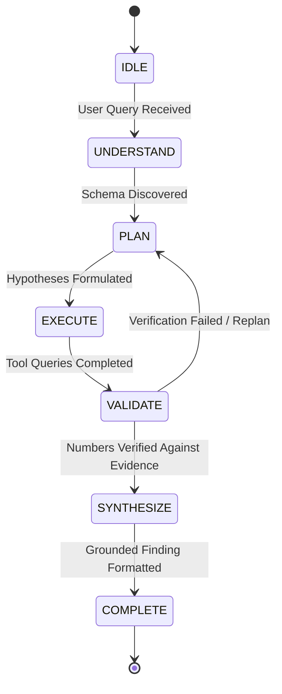

# Athena Agent Architecture & State Machine

## 1. Overview
Athena replaces the brittle `User → LLM → Answer` paradigm with a structured, multi-step analytical state machine:

---

## 2. Specialized Tool Registry
The agent has access to a dedicated set of deterministic analytical tools:

| Tool Name | Engine | Purpose |
|---|---|---|
| `inspect_schema()` | DuckDB / Profiler | Inspect column names, data types, nullability |
| `run_sql()` | DuckDB | Execute safe read-only SQL queries |
| `compare_periods()` | Python / SciPy | Period-over-period variance with segment contribution |
| `decompose_revenue_drivers()` | Statistical Engine | Decomposes delta into Volume Effect vs Price/AOV Effect |
| `detect_anomalies()` | Scikit-learn / SciPy | Scans for outliers via IQR, Z-Score, or Isolation Forest |
| `calculate_correlation()` | SciPy | Pearson & Spearman correlation with linear regression |
| `search_documentation()` | RAG Engine | Searches policy/contract documents with prompt injection isolation |
| `generate_chart()` | Visualizer Engine | Builds Recharts-compatible chart specifications |

---

## 3. Hypothesis Generation & Falsification
When presented with a causal question like *"Why did revenue decline in Q3?"*, Athena automatically generates competing explanations:
- **Hypothesis 1:** Revenue decline came from lower transaction order volume.
- **Hypothesis 2:** Average Order Value (AOV) contracted due to discounting.
- **Hypothesis 3:** Regional collapse in North America.
- **Hypothesis 4:** Shift in product sales mix toward commodity hardware.

Each hypothesis is individually tested against the data and assigned a definitive status: `supported`, `refuted`, or `inconclusive` with concrete numerical proof.

---

## 4. "Challenge Athena" Self-Critique Engine
Athena's signature differentiator is the ability to actively attempt to falsify its own conclusions upon request. The challenge engine conducts 4 rigorous stress tests:
1. **Outlier Sensitivity Stress-Test:** Excludes the top 1% highest-value contracts and verifies whether the trend still holds.
2. **Temporal Window Sensitivity:** Shifts the observation window by +/- 15 days across rolling 90-day intervals to check for calendar boundary artifacts.
3. **Sub-Segment Divergence Check:** Examines whether specific sub-cohorts (e.g. SMB accounts) grew while Enterprise accounts fell.
4. **Counter-Factual Pricing Analysis:** Measures gross list prices vs net realization to test if discount changes explain the variance.
